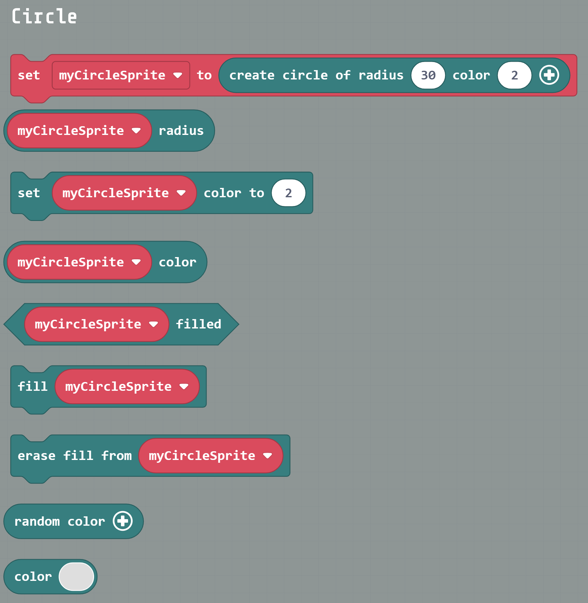

# circle-ext-best
## A MakeCode Arcade Extension for Manipulating Circles

This MakeCode Arcade extension provides blocks that create and manipulate circle sprites. It is "Best" in a series of similar extensions dubbed good-better-best. A program using this extension must also install Arcade Sprite Data Extension from the Arcade dashboard. Alternatively, the extension [arcade-sprite-data-revised](../../../arcade-sprite-data-revised) can be used.

## Why this Extension is Best
This extension is "Best" because unlike circle-ext-better ("Better")and circle-ext-good ("Good"), in this extension a circle ***is a sprite***, which enables it to be used with all sprite blocks, e.g., , sprite properties, sprite arrays and on-sprite-overlap blocks. Although [Better](../../../circle-ext-better) and [Good](../../../circle-ext-good) have the same capabilities as Best, either they are awkard to use or obtuse to implement. 

## Example MakeCode Arcade Programs the Use this Extension
### Breathing Circles
### Other
### Other

## Custom Blocks in circle-ext-best

#### The line of code below should be a generated MakeCode block -- it is not
```blocks
  myCircle = circle.createCircle(ndx, color)
```

```blocks
basic.showNumber(5)
```
```block
basic.showNumber(5)
```
 ``[let txt = "text"]``
 
#### The line of code below should be typescript -- it is.
```typescript
  myCircle = circle.createCircle(ndx, color)
```
## Blocks defined by this MakeCode Arcade Extension



## Use as Extension

This repository can be added as an **extension** in MakeCode.

* open [https://arcade.makecode.com/](https://arcade.makecode.com/)
* click on **New Project**
* click on **Extensions** under the gearwheel menu
* search for **https://github.com/wecodemakecode/circle-best-ext* and import

## Edit this project 

To edit this repository in MakeCode.

* open [https://arcade.makecode.com/](https://arcade.makecode.com/)
* click on **Import** then click on **Import URL**
* paste **https://github.com/wecodemakecode/circle-best-ext* and click import

#### Metadata (used for search, rendering)

* for PXT/arcade
<script src="https://makecode.com/gh-pages-embed.js"></script><script>makeCodeRender("{{ site.makecode.home_url }}", "{{ site.github.owner_name }}/{{ site.github.repository_name }}");</script>
